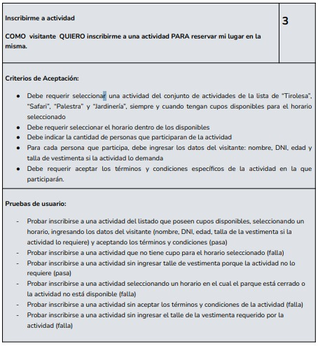

INICIO DE DESARROLLO DE APLICACION: 

Enunciado: (3)

Texto:
Inscribirme a actividad

COMO visitante QUIERO inscribirme a una actividad PARA reservar mi lugar en la misma.

Criterios de Aceptación:

    Debe requerir seleccionar una actividad del conjunto de actividades de la lista de “Tirolesa”, “Safari”, “Palestra” y “Jardinería”, siempre y cuando tengan cupos disponibles para el horario seleccionado.

    Debe requerir seleccionar el horario dentro de los disponibles.

    Debe indicar la cantidad de personas que participarán de la actividad.

    Por cada persona que participe, debe ingresar los datos del visitante: nombre, DNI, edad y talla de vestimenta si la actividad lo demanda.

    Debe requerir aceptar los términos y condiciones específicos de la actividad en la que participarán.

Pruebas de usuario:

    Probar inscribirse a una actividad del listado que poseen cupos disponibles, seleccionando un horario, ingresando los datos del visitante (nombre, DNI, edad, talla de la vestimenta si la actividad lo requiere) y aceptando los términos y condiciones (pasa).

    Probar inscribirse a una actividad que no tiene cupo para el horario seleccionado (falla).

    Probar inscribirse a una actividad sin seleccionar un horario en el cual el parque esté cerrado o no esté disponible (falla).

    Probar inscribirse a una actividad seleccionando un horario en el cual el parque está cerrado o no está en estado disponible (falla).

    Probar inscribirse a una actividad sin aceptar los términos y condiciones de la actividad (falla).

    Probar inscribirse a una actividad sin ingresar el talle de la vestimenta requerido por la actividad (falla).